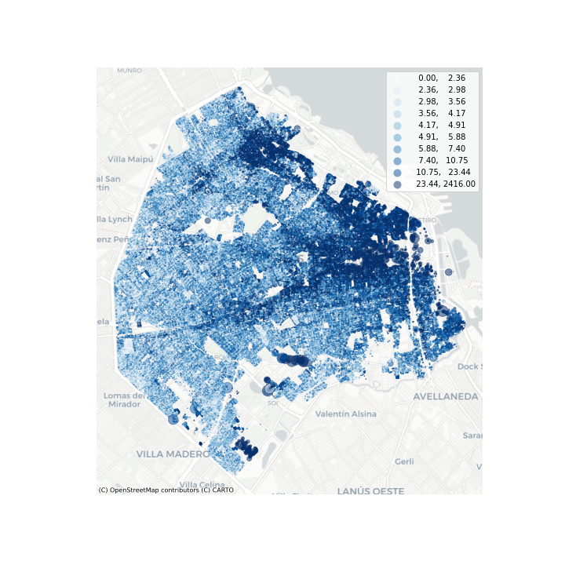

# dasimetrizacion_ba
Parte del material de clases del Seminario de Analisis Espacial con Python dictado en la Maestría de Generación y Análisis de INformación Estadística de UNTREF para obtener una distribución dasimétrica de la población de CABA por parcela, combinando información censal con el Relevamiento de Usos del Suelo.

En resumen, distribuimos la poblacion total de cada radio censal dentro de las parcelas de uso residencial que la componen, proporcionalmente a la superficie construida de cada una. Los datos de población surgen del [Censo 2010](https://data.buenosaires.gob.ar/dataset/informacion-censal-por-radio) y los datos de las parcelas del [Relevamiento de Usos del Suelo 2011](https://data.buenosaires.gob.ar/dataset/relevamiento-usos-suelo).

El resultado final es un dataset con centroides de parcelas con totales poblacionales para cada parcela.

Perdemos algo así como el 6 % de la población por radios censales con poblacion pero sin parcelas residenciales o sin superficie construida.

Pueden encontrar bibliografía sobre este método en [Rosso, 2016](http://igeopat.org/parrafosgeograficos/images/RevistasPG/2016_V15_1/25-7.pdf); [Maantay et al, 2007](https://www.semanticscholar.org/paper/Mapping-Population-Distribution-in-the-Urban-The-Maantay-Maroko/b376c52694aa87fb6efcb6cbc107cbdb92bf9dd2) y [Lwin et al, 2010](https://creativecity.gscc.osaka-cu.ac.jp/IJG/article/view/500)

